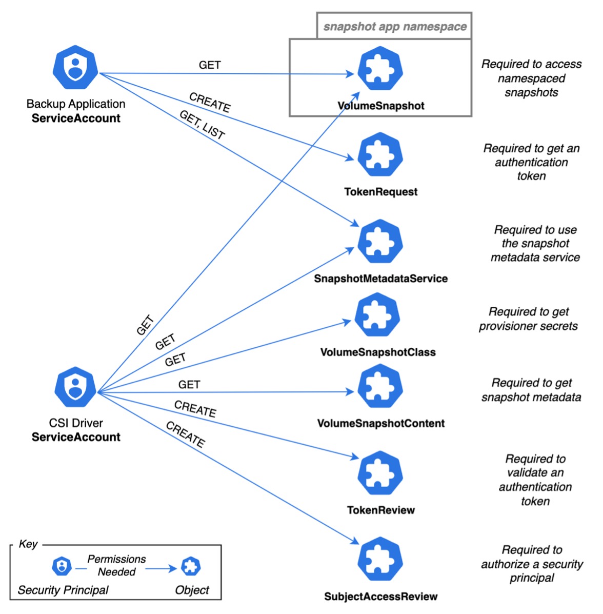

#  Accelerating Data Protection with Changed Block Tracking

When IT, Virtualization, Backup, Storage, and Operations teams explore Kubernetes, they compare storage and data protection capabilities with traditional bare metal and Virtual Machine facilities. Because cloud native architecture is inherently distributed, API driven, and loosely coupled, cloud native operations require new tooling and skills to achieve the same disaster recovery business outcomes. While many cloud native storage benefits are impressive, one critical area has been missing: Changed Block Tracking (CBT).

In the simplest case, CBT improves [backup efficiency](https://en.wikipedia.org/wiki/Incremental_backup) by finding and transmitting only the difference between what currently lives in storage and the most recent backup image. CBT can find that there is little to no change since the last backup, making a nearly instantaneous new backup with minimal resource consumption of time, CPU, memory, and storage. Making backup windows short and light weight helps organizations perform backups with increased frequency, which reduces the Recovery Point Objective (amount of data loss) disaster recovery metric.

CBT is a feature of storage systems: most provide the ability to snapshot volumes, creating a read-only view of the volume at the time of the snapshot. With CBT enabled, the storage system tracks every block that is written and can provide a list of blocks that have changed between two snapshots.  If a block is written multiple times between snapshots, it only needs to be copied once. Empty blocks which have never been written are skipped. CBT features make backup of volumes very efficient.

Because nearly every storage provider offers CBT, it is surprising that cloud native storage with Kubernetes lacks this capability. Why? A longer answer follows, but the short answer is after two years of work, Kubernetes CBT is almost here! Now is the time for storage and backup vendors and projects to prototype, give feedback, and improve CBT into an industry-wide solution as it enters Kubernetes alpha phase.

## Stateful Kubernetes Workloads and Storage

[Kubernetes just celebrated it's tenth birthday](https://www.cncf.io/blog/2024/06/07/kubernetes-is-ten-years-old/) and stateful workloads are normal today, but when Kubernetes released `StatefulSets` in 2018, it took time for [cloud native storage to follow and accelerate over the latter half of Kubernetes life](https://www.veeam.com/blog/stateful-vs-stateless-kubernetes.html). The Container Storage Interface (CSI), version 1.0 was also adopted in 2018 with [Kubernetes 1.13](https://kubernetes.io/blog/2018/12/03/kubernetes-1-13-release-announcement/).

CSI provides a uniform Application Programmer Inferface (API) for different storage providers. CSI is an independent consortium that publishes industry-wide specifications and storage vendors create CSI drivers, which are installed onto Kubernetes clusters. All  proprietary, "in-tree" storage drivers in the Kubernetes code base are in process of removal or have been removed in favor of CSI. Fun fact: CSI is adopted by other cloud native platforms, such as Cloud Foundry, Apache Mesos, and Hashicorp Nomad!

The [Kubernetes Data Protection Working Group](https://github.com/kubernetes/community/blob/master/wg-data-protection/README.md) (DPWG) was formed in 2020 by the [Kubernetes Storage Special Interest Group](https://github.com/kubernetes/community/tree/master/sig-storage) (SIG-Storage). The same year, the CSI Consortium published the `VolumeSnapShot` specification, which released in Kubernetes 1.20. Kubernetes backup and recovery could only deal with filesystems via CSI or resort to a proprietary storage driver before this time. CSI block storage backup became possible and faster than filesystem backup.

## Where is CBT?

A simplified series of events follows; they describe how CBT was added to CSI and Kubernetes.

In May 2022, DPWG began a [Kubernetes Enhancement Proposal (KEP) #3314](https://github.com/kubernetes/enhancements/pull/4082): Changed Block Tracking. Veeam joined the effort soon afterwards. With guidance and review from SIG leadership, peer SIGS, vendors, and the Kubernetes community, the KEP went through three major redesigns. Each progressed through repeated conceptual phases to design review and defense, every step improving the scope to address issues and gaps. The CBT design improved after reviews with SIG API and SIG Security helped incorporate Kubernetes architecture and security best practices. At last, in 2023, the third design was approved by the DPWG, a code prototype was completed, and then a proposal was made to add CBT to the CSI specification.

The [CSI specification 1.11.0](https://github.com/container-storage-interface/spec/releases/tag/v1.10.0) with CBT via the `SnapshotMetadata` service was recently published, this updated KEP-3314 status to “implementable” in June 2024. The first target was Kubernetes 1.31 as alpha APIs with the prototype code, but gearing up pipelines to test, add documentation, and learning other Kubernetes and CSI maintainer tasks has caused it to slip to Kubernetes 1.32.

## The Design of Cloud Native CBT

The intended audience for CSI CBT implementation is Kubernetes cloud native Backup and Storage vendors. CBT design consists of two new areas:

- Storage vendors and projects should adopt and deploy the SIG-Storage CSI CBT metadata service sidecar container and custom resource(s), then the CSI driver should implement:
    - https://github.com/kubernetes-csi/external-snapshot-metadata
    - Add new "SnapshotMetadata service" to allow the container orchestrator to obtain allocated or changed block metadata for snapshots = https://github.com/container-storage-interface/spec/blob/v1.10.0/spec.md#snapshot-metadata-service-rpcs
-	Kubernetes APIs, used by backup providers, which consume CSI CBT via gRPC:
    - The KEP is currently a “v1alpha” implementation of the CSI specification = https://github.com/kubernetes/enhancements/pull/4082

The following security diagram shows how a backup software vendor and a storage vendor would orchestrate and provide CBT access to a VolumeSnapShot:

More technical resources:
- [KEP 3314 Design Slides and Diagrams](https://docs.google.com/presentation/d/11nCmMkOEm5sY7zGQeXmsAV2wR7mb8HUYPKWyXhyD86o/edit#slide=id.p)
-	Cloud Native Rejekts 2023 talk: “Revolutionizing Data Backup in Kubernetes: Unlocking the Power of Change Block Tracking With CSI“ [abstract](https://cfp.cloud-native.rejekts.io/cloud-native-rejekts-na-chicago-2023/talk/HGPYB3/) and [video](https://www.youtube.com/watch?v=sV1skj7OW7Y&list=PLnfCaIV4aZe-4zfJeSl1bN9xKBhlIEGSt&index=29) (30 minutes)
-	[DPWG: Data Protection Workflows](https://github.com/kubernetes/community/blob/master/wg-data-protection/data-protection-workflows-white-paper.md) white paper

## Conclusion and Calls to Action

The journey to cloud native CBT has just begun the implementation phase. The Kubernetes DPWG and CSI Consortium want your feedback on CSI CBT!

At Veeam, our engineering culture introduction has [this quote](https://quoteinvestigator.com/2021/05/04/no-plan/) (attributed to Helmuth von Moltke (“The Elder”), 1800-1891):
> **No plan survives contact with the enemy.**

As CSI CBT enters alpha phase, you can help with adoption and improvements: please spread the word and provide feedback that can be incorporated into the beta phase. 
- __For storage vendors and projects:__ is adopting CSI CBT as simple as exposing existing functionality via the new CSI CBT sidecar container API? That depends on the current architecture of the CSI driver and your underlying storage CBT functionality. Please let us know if the example is helpful.
- __For backup vendors and projects:__ shouldn't CSI CBT adoption be as simple as consuming the new Kubernetes APIs with a supporting CSI CBT storage vendor? Where are the mock providers and tests, do they meet your needs?
- __For the Kubernetes community:__ please reach out to your backup and storage vendors and projects and ask them to adopt CSI CBT to improve your data protection!

Veeam has put CSI CBT on our roadmap: is it on yours?

Help CSI CBT be a success: [join the DPWG bi-weekly meeting or reach out on the Slack channel and mailing list](https://github.com/kubernetes/community/blob/master/wg-data-protection/README.md#meetings); we are available to answer questions! Please register to attend the [Kubernetes Data Protection Working Group Deep Dive](https://kccncna2024.sched.com/event/1hovn/kubernetes-data-protection-wg-deep-dive-dave-smith-uchida-veeam?iframe=no&w=100%25&sidebar=yes&bg=no) talk on Wednesday, November 13 at KubeCon North America.

Every day, more people ask: "is now the time to migrate to Kubernetes?" Bringing CSI CBT to cloud native storage removes a critical disadvantage when compared to traditional infrastructure: longer recovery point and recovery times. At Veeam, we have helped steward Kubernetes data protection improvements with the help of incredible partners, mentors, and reviewers in the CSI Consortium and Kubernetes DPWG and SIGs. We are eager to collaborate with the cloud native ecosystem and community to implement CSI CBT and drive world class, cloud native data protection forward!
